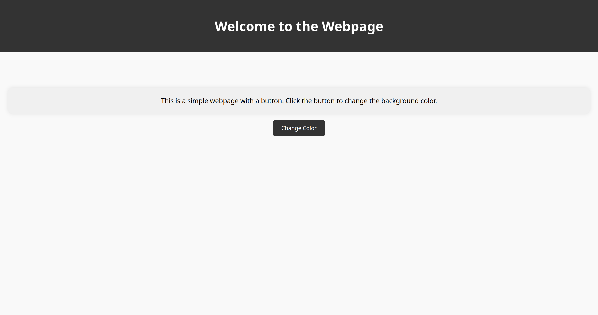
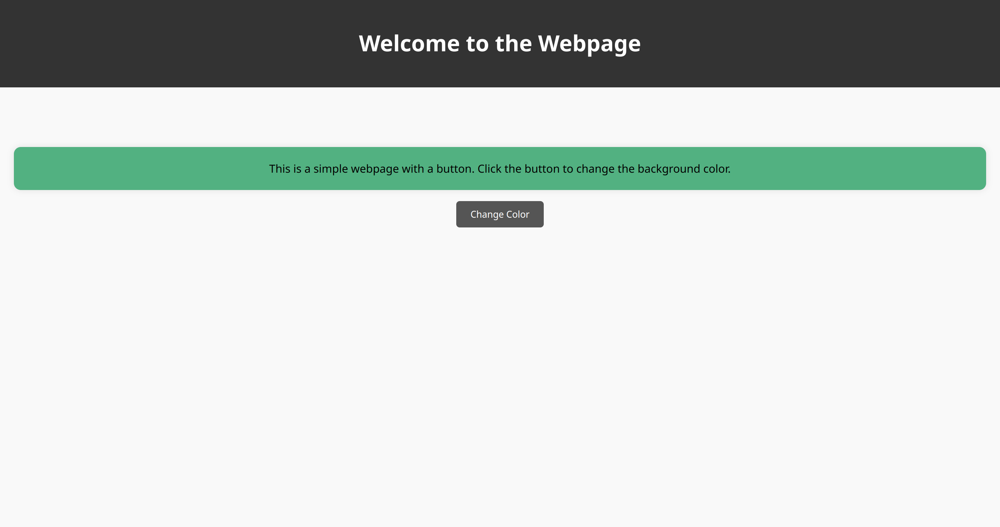
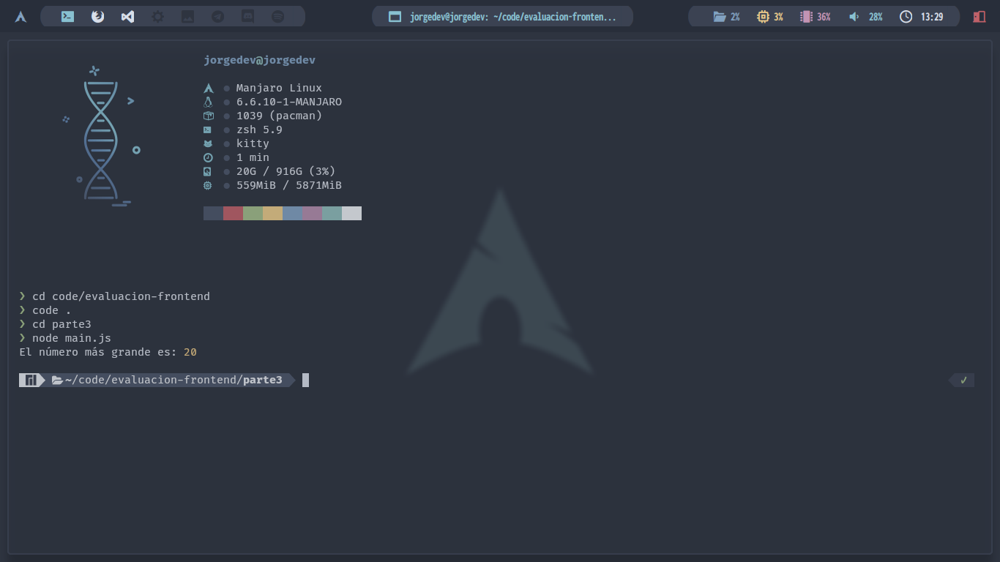
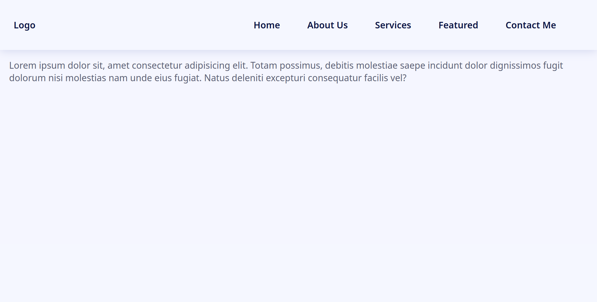
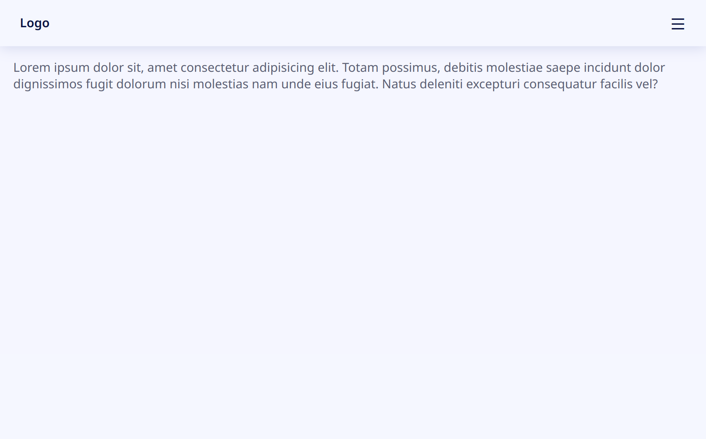
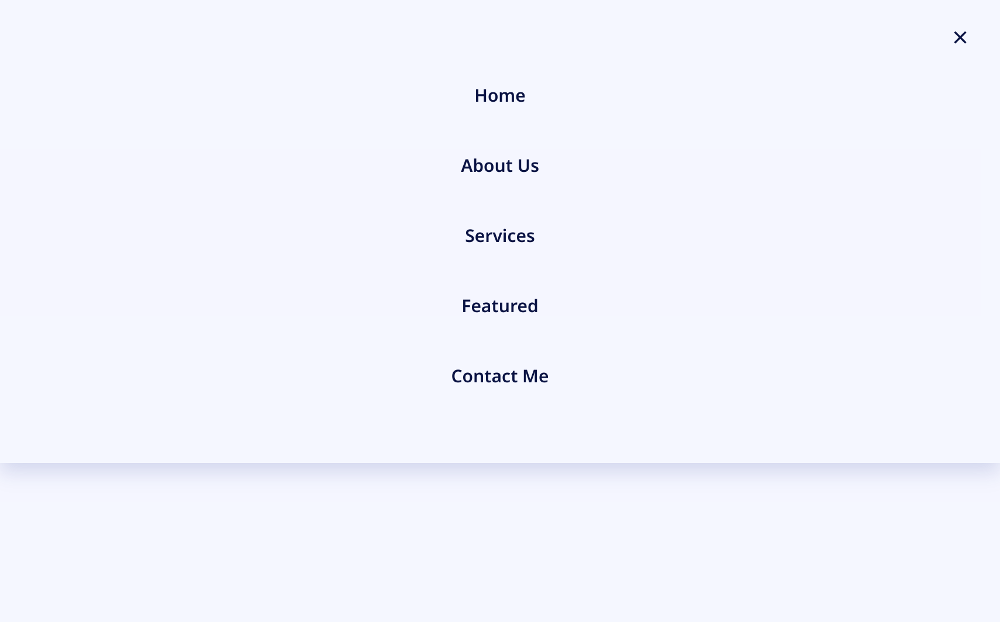
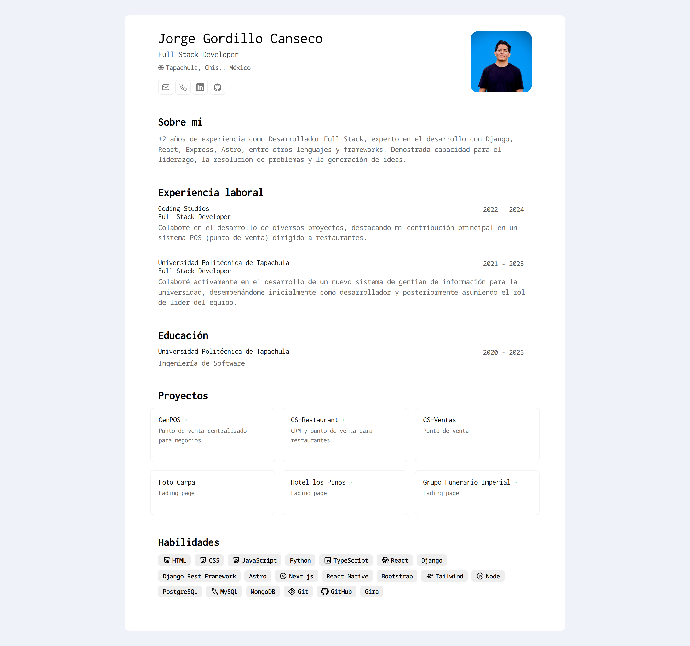
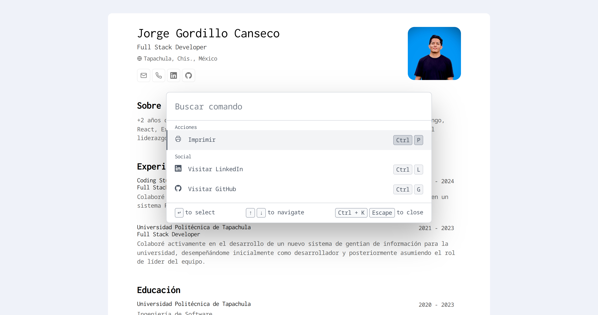

# Examen de Desarrollador Front-End

### Parte 1: Conceptos Teóricos

1. **HTML/CSS**:

- Explica la diferencia entre _margin_ y _padding_ en **CSS**:

Margin (margen): Es el espacio exterior al borde de un elemento, que afecta la disposición entre elementos adyacentes.

Padding (relleno): Es el espacio interior al borde de un elemento, que afecta al espacio dentro del propio elemento.

En resumen, margin afecta la disposición entre elementos, mientras que padding afecta al espacio dentro de un elemento.

- Que es el modelo de caja en **CSS** y cuales son sus componentes principales?

El modelo de caja en CSS es un concepto que describe cada elemento HTML como una "caja" rectangular con cuatro componentes principales:

Contenido: Es el área donde se muestra el contenido del elemento.
Relleno (Padding): Es el espacio entre el contenido y el borde del elemento.

Borde: Es la línea que rodea el contenido y el relleno.

Margen: Es el espacio fuera del borde, que controla la distancia entre el elemento y otros elementos adyacentes.

Estos componentes determinan el tamaño y la apariencia visual del elemento en la página web.

2. **JavaScript**:

- Explique el concepto de "Hoisting" en JavaScript.

El "hoisting" en JavaScript es un comportamiento donde las declaraciones de variables y funciones son movidas al inicio de su contexto de ejecución durante la fase de compilación. Esto significa que aunque puedan ser referenciadas antes de ser declaradas en el código, en tiempo de ejecución su declaración es procesada antes de cualquier otra parte del código dentro del mismo contexto.

- Cual es la diferencia entre _let_, _const_ y _var_ en la declaración de variables?

**var**: Tiene un alcance de función y puede ser redeclarada y reasignada.

**let**: Tiene un alcance de bloque, no puede ser redeclarada en el mismo bloque, pero sí puede ser reasignada.

**const**: También tiene un alcance de bloque, debe ser inicializada con un valor y no puede ser reasignada.

- Describa como funciona el _event bubbling_ en el contexto de eventos de JavaScript.

El "event bubbling" en JavaScript es cuando un evento disparado en un elemento se propaga hacia arriba a través de sus ancestros en el árbol DOM. Esto significa que si se activa un evento en un elemento hijo, también se activará en sus elementos padre, hasta llegar al elemento raíz del documento.

3. **Responsive Web Design**:

- Que son los _media queries_ y como se utilizan en CSS para crear un diseño receptivo?

Los "media queries" en CSS son reglas que permiten aplicar estilos específicos basados en las características del dispositivo, como el ancho de la pantalla. Se utilizan para crear diseños receptivos que se adapten a diferentes tamaños de pantalla. Por ejemplo, se pueden definir estilos diferentes para dispositivos móviles, tabletas y computadoras de escritorio. Esto mejora la experiencia del usuario al garantizar que el contenido se vea bien en cualquier dispositivo.

- Mencione al menos 2 técnicas para hacer que las imágenes sean receptivas en una pagina web.

Unidades de tamaño relativas: Utiliza porcentajes o unidades como vw para definir el tamaño de las imágenes. Esto permite que se ajusten automáticamente al tamaño del contenedor padre.

```css
img {
  max-width: 100%;
  height: auto;
}
```

Atributo srcset: Proporciona múltiples versiones de una imagen con diferentes tamaños utilizando el atributo srcset, permitiendo que el navegador elija la mejor según las características del dispositivo y la pantalla.

```html

```

### Parte 2: Ejerció Práctico

4. **HTML/CSS/JS**:

- Crea una pagina web simple con un encabezado, un párrafo de texto y un botón.
- Al hacer clic en el botón, cambia el color color del fondo del párrafo de texto a otro color.

</img>
</img>

### Parte 3: Resolución de Problemas

5. **Problema de Lógica**:

- Escribe una función en JavaScript que tome un arreglo de números como parámetros y devuelve el número mas grande.

</img>

### Parte 4: Proyecto Práctico

6. **Desarrollo de Componente**:

- Desarrolla un componente de barra de navegación (navbar) completamente responsivo utilizando HTML, CSS y opcionalmente JavaScript si es necesario.
- Asegúrate de que la barra de navegación tenga al menos 3 elementos de navegación y que se adapte adecuadamente a diferentes tamaños de pantalla.

</img>
</img>
</img>

7. **Desarrollo de Componente**:

- Crea tu CV como un pagina web integrando sass en donde este pueda ser descargado mediante un botón en formato pdf.

</img>
</img>
